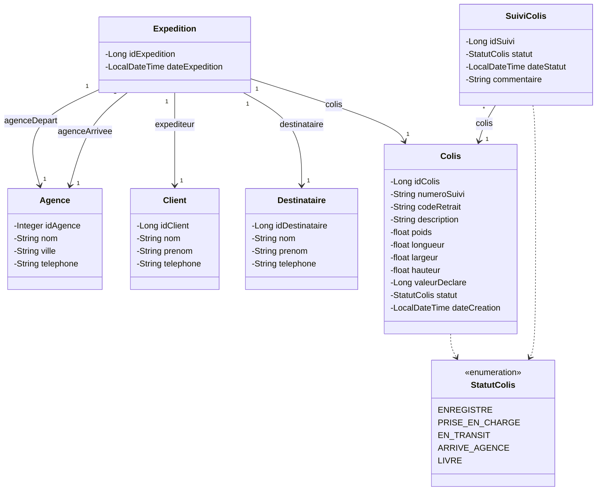

# Diagramme de classes

Diagramme du modèle de domaine (couche `model`), correspondant aux entités JPA et à
leurs relations.

## Notes de lecture

- **Expedition** est le pivot du modèle : elle relie en une seule création un
  **Client** (expéditeur), un **Destinataire**, deux **Agence** distinctes (départ et
  arrivée) et exactement un **Colis** (relation 1-1, portée par `Expedition`, qui détient
  la clé étrangère `id_colis`).
- **SuiviColis** journalise (1 à N) chaque changement de statut d'un **Colis** ; une ligne
  y est ajoutée automatiquement à chaque étape (y compris l'enregistrement initial).
- `Agence`, `Client` et `Destinataire` n'ont pas de référence retour vers `Expedition` —
  les relations sont unidirectionnelles, portées côté `Expedition`/`SuiviColis`.
- Le statut d'un **Colis** ne peut progresser que dans l'ordre de l'énumération
  `StatutColis` (`ENREGISTRE → PRISE_EN_CHARGE → EN_TRANSIT → ARRIVE_AGENCE`), la
  transition vers `LIVRE` n'étant possible que via le processus de réception.
